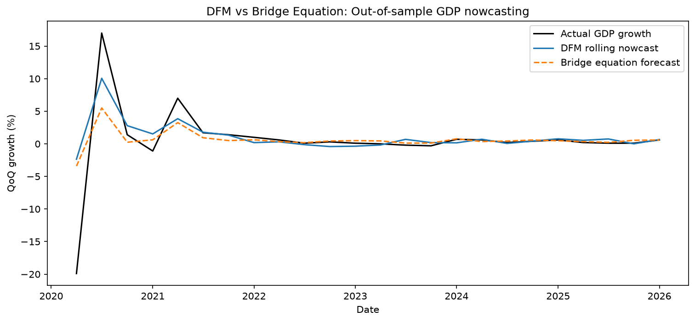

# UK GDP Nowcasting

This project estimates UK quarterly GDP growth before the official figure 
is released, using monthly indicators (Index of Services, Index of 
Production) that come out well ahead of the quarterly number. I tried two 
approaches: a bridge equation and a Dynamic Factor Model (DFM) that handles 
monthly and quarterly data together. I also caught a misleading result 
along the way, which is worth reading before the headline numbers below.

## Headline result

| Model | Out-of-sample R² |
|---|---|
| Bridge equation | 0.425 |
| Dynamic Factor Model (rolling) | 0.488 |

The DFM beats the bridge equation, but only modestly, once both are tested 
properly on data they haven't seen.

## The in-sample trap

My first pass at evaluating the DFM gave an R² of 0.951. That number was 
misleading — it came from checking the model against data it had already 
seen during training, using a single long-range forecast that flattened 
out almost immediately instead of updating as new data came in. Once I 
refit the model using training data only and tested it one quarter at a 
time on data it hadn't seen, the honest R² dropped to 0.488. Full detail 
on both versions is in the methodology doc.

## Charts

**DFM vs bridge equation, out-of-sample:**

Neither model captures the full size of the 2020 GDP swing, but the DFM 
reacts more than the bridge equation at the peak, which is where its 
small edge comes from. From 2022 onward, in calmer conditions, the two 
models track actual GDP almost identically.

Full methodology and evaluation details are in [`docs/methodology.md`](docs/methodology.md).

## Data

- Quarterly target: UK GDP quarter-on-quarter growth (ONS series IHYQ)
- Monthly indicators: Index of Services and Index of Production, from 
  ONS's GDP monthly estimate dataset
- Sample: January 1997 onward, the earliest point monthly GDP data exists
- All series converted to growth rates before modeling, since the levels 
  are non-stationary

## How to reproduce

1. Clone this repo
2. Create a virtual environment and run `pip install -r requirements.txt`
3. Open `notebooks/01_nowcasting_exploration.ipynb` and run all cells

## Project structure

data/raw          - original ONS CSVs (monthly indicators, quarterly GDP)
notebooks/        - main analysis notebook
results/figures/  - saved plots
docs/             - full methodology write-up

## Limitations

- Several of the 24 rolling DFM refits didn't fully converge within the 
  maximum EM iterations, which adds some uncertainty to individual 
  quarterly estimates
- The DFM doesn't report standard errors here, so I can't assess 
  statistical significance the way I could for the bridge equation
- Only about 117 quarterly observations total, which limits how much 
  weight any single evaluation split can carry
- Neither model captures the full size of extreme shocks like COVID, 
  only a partial reaction to them